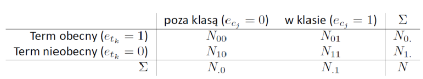
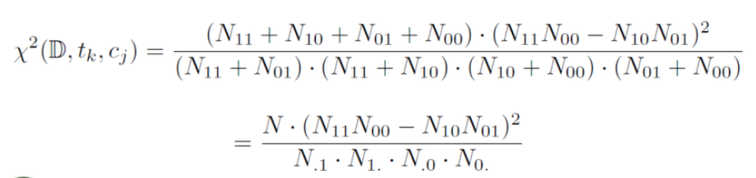

# Naive Bayes
A Naive Bayes classifier is a probabilistic machine learning model that’s used for classification task. The crux of the classifier is based on the Bayes theorem.

Using Bayes theorem, we can find the probability of c happening, given that x has occurred. Here, x is the evidence and c is the hypothesis. The assumption made here is that the predictors/features are independent. That is presence of one particular feature does not affect the other. Hence it is called naive.
## Chi-Square  feature selection
All the information can be found in the tables below, also refer to the [documentation](https://ieeexplore.ieee.org/document/8965332).

## Reading

Input: 
* number of documents in the training set (N),
* N training documents (1 per line),
* line of ones and zeros indicating whether the i-th document has been
classified in class c_{j} (1) or not (0),
* document to be classified,
* number of terms to be selected in feature selection (k).

## Processing
First, the data was cleaned, punctuation was removed, and letters were reduced.

Then words most differentiating document classes were found (number of words is chosen by user).

After that, probability of belonging to classes was calculated using naive bayes classifier, it selected class with highest probability (if probability is equal, it assigns to 1 class).
## Output

Output:
* 0 or 1 - indicating the result of the document classification.

