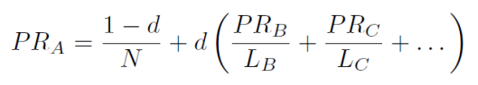

# PageRank

 a method of assigning a specific numerical value to indexed web pages, indicating their quality, using by google.

## Reading

Input: initial website address

## Processing

From the link entered, the links found on the page were retrieved. Checked whether these links contain other links, if so, the program adds them (depth: 2). Based on the scheme "page: [list of links]" a page-links matrix was created, where 1 means that the page has a link and 0 when it does not (repetition of links was ignored).  

From the matrix was calculated PageRank, where d=.85. The results are given to 4 decimal places. Iterations were also used to calculate the optimal PageRank (until changes in values occurred to 6 decimal places).

## Method

The PageRank algorithm outputs a probability distribution used to represent the likelihood that a person randomly clicking on links will arrive at any particular page. PageRank can be calculated for collections of documents of any size. It is assumed in several research papers that the distribution is evenly divided among all documents in the collection at the beginning of the computational process. The PageRank computations require several passes, called "iterations", through the collection to adjust approximate PageRank values to more closely reflect the theoretical true value.

The PageRank theory holds that an imaginary surfer who is randomly clicking on links will eventually stop clicking. The probability, at any step, that the person will continue is a damping factor d. Various studies have tested different damping factors, but it is generally assumed that the damping factor will be set around 0.85.

where:

PRi - PageRank of page i

d - dumping factor
 
Li - number of outgoing links to other websites from website i
## Output

Output: A list with PageRank measure values for documents sorted by URL.

