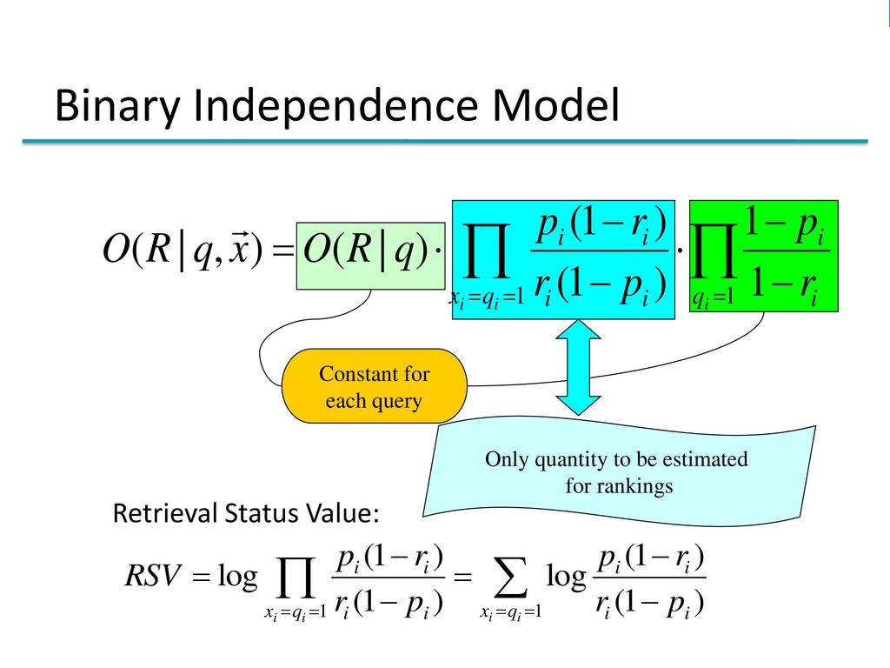

# Probabilistic

The probabilistic method calculates the similarity of a document to a query as the 
probability that the document is relevant to the query. We used the simplest model to 
estimate relevance: Binary Independence Retrieval (BIR), which is based on
Retrieval Status Value (RSV) estimation (simplifying, 
I don't want to elaborate on what this results from, I can only refer you to the [reading](https://nlp.stanford.edu/IR-book/pdf/11prob.pdf))
## Reading

* number of documents to be processed (n)
* n documents
* query (multi-word)
* a line of ones and zeros indicating the relevant documents

## Processing

Calculation of metrics needed for RSV:
* number of relevant documents (relevant_document)
* number of all documents (all_document)
* number of relevant documents that have the search term (how_many_relevant_doc_have_word)
* number of documents that have the search term (how_many_doc_have_word)

## Method
Used: Retrieval Status Value (RSV)

Źródło:https://slideplayer.com/slide/12118003/

## Output

n element list with probability values of a given document for the query

